# SCALE LXP Application Architecture

This document describes the SCALE LXP API architecture, runtime components, external dependencies, data stores, queues, and primary data flows. It is intended for engineering onboarding, security reviews, vendor assessments, and HECVAT-style architecture documentation.

## System Overview

SCALE LXP is a classroom-based supply chain simulation platform. Instructors create classes, define store and scenario variables, publish weekly scenarios, enter global outcomes, and review student results. Students create stores, submit weekly decisions, and view simulation results. Background workers use queue-based processing and OpenAI to calculate individualized ledger entries.

The platform includes a React frontend and three deployable Express applications that share service, model, middleware, queue, email, and OpenAI libraries:

- **Web app:** Student/instructor UI under `apps/web/` (Vite SPA, separate `package.json`, deployed as a DigitalOcean static site).
- **API service:** Main REST API under `apps/api/`.
- **Webhooks service:** External webhook receiver under `apps/webhooks/`.
- **Workers service:** Background queue and scheduled job processor under `apps/workers/`.

The web app is not part of the shared Express codebase; it calls the API over HTTPS with Clerk-authenticated requests.

Supporting tools include a simulation CLI and an email preview app, but they are not part of the primary production request path.

## High-Level Container Diagram

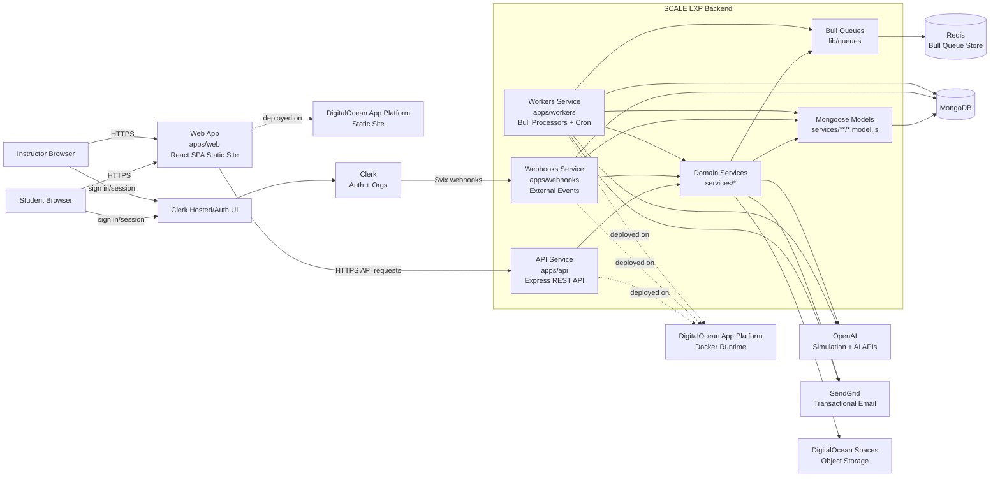

## Runtime Component Diagram

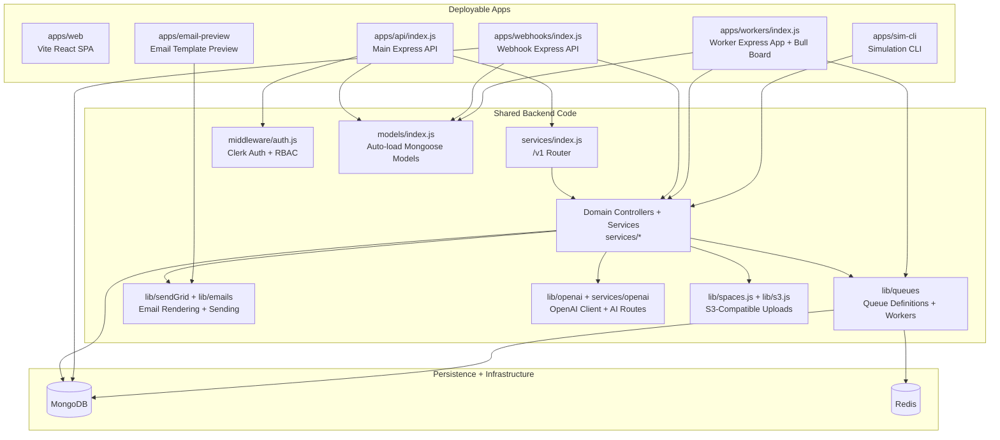

## Primary Components

| Component | Location | Responsibility | Primary Data In | Primary Data Out |
| --- | --- | --- | --- | --- |
| API service | `apps/api/` | Serves the `/v1` REST API, applies Clerk middleware, connects to MongoDB, and mounts domain routes. | Browser requests, Clerk session claims, JSON payloads | JSON responses, MongoDB writes, queue jobs |
| Webhooks service | `apps/webhooks/` | Receives external provider events, currently Clerk webhooks. | Signed provider webhooks | Member, organization, and membership synchronization records |
| Workers service | `apps/workers/` | Runs Bull processors, scheduled jobs, and Bull Board queue UI. | Redis queue jobs, cron definitions, MongoDB records | Ledger entries, job status updates, email sends, OpenAI batch updates |
| Domain services | `services/*` | Implements application business logic by domain. | Authenticated requests, worker jobs, webhook events | Domain model reads/writes, queued work, external API calls |
| Mongoose model loader | `models/index.js` | Registers every `*.model.js` file under `services/`. | Service model definitions | Registered MongoDB models |
| Auth middleware | `middleware/auth.js` | Enforces authentication, organization context, role checks, and member/org hydration. | Clerk identity and request context | Authorized request context or rejected request |
| Queue library | `lib/queues/` | Defines Bull queues and worker processors. | Enqueued jobs, Redis configuration | Worker execution, job lifecycle updates |
| OpenAI integration | `lib/openai/`, `services/openai/`, `services/ledger/` | Provides general AI endpoints and simulation outcome generation. | Prompts, simulation context, ledger history, images/audio where applicable | Structured AI responses, ledger values, auxiliary AI outputs |
| Email integration | `lib/sendGrid/`, `lib/emails/` | Renders email templates and sends transactional email through SendGrid. | Notification records, template props | Email delivery requests and delivery status |
| Object storage | `lib/spaces.js`, `lib/s3.js` | Uploads files to DigitalOcean Spaces or S3-compatible storage. | Uploaded files or image buffers | Public or stored object URLs |
| MongoDB | External | Primary system of record for users, organizations, classrooms, scenarios, submissions, jobs, ledgers, notifications, cron jobs, and variables. | Mongoose reads/writes | Persisted application state |
| Redis | External | Queue backing store for Bull. | Queue job payloads and metadata | Worker-readable jobs and queue state |
| Clerk | External | User authentication, organizations, memberships, and webhook events. | User sessions, org changes, membership events | Auth claims, webhook events |
| SendGrid | External | Transactional email provider. | Rendered email content and recipients | Delivered email or provider error |
| OpenAI | External | AI simulation and auxiliary AI capabilities. | Structured prompts and request payloads | JSON simulation results or AI-generated outputs |

## Domain Model Map

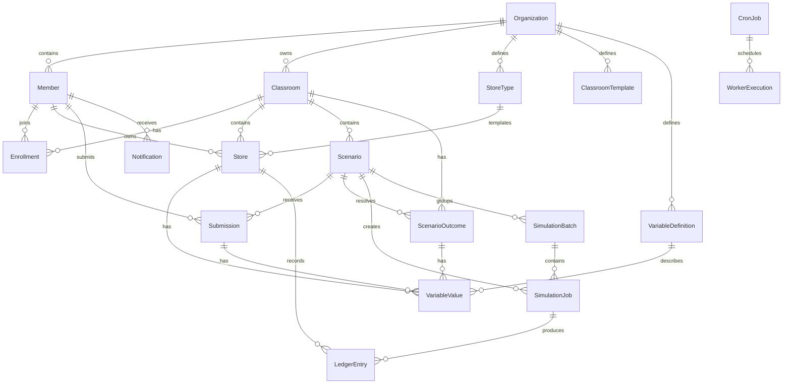

> Note: The diagram expresses logical relationships used by the application. Exact schema fields and cardinality are defined in the Mongoose models under `services/**/*.model.js`.

## API Request Data Flow

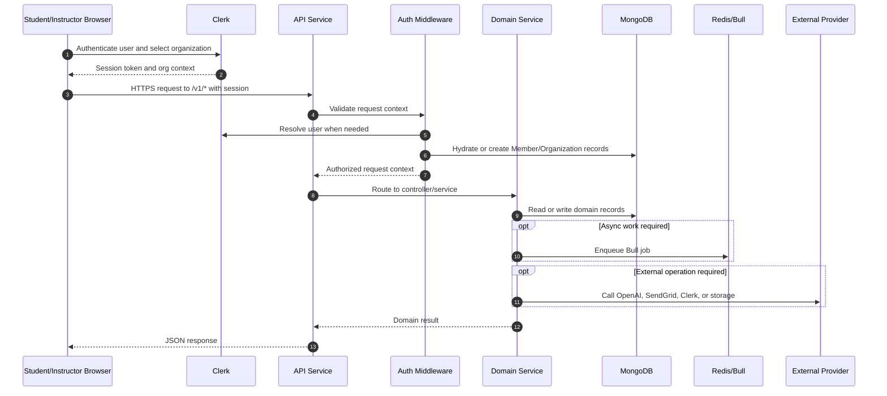

### API Flow Description

1. A student or instructor authenticates through Clerk and receives a session token and organization context.
2. The browser sends an HTTPS request to the API service under `/v1`.
3. The API service runs Clerk middleware and route-specific authorization checks.
4. `middleware/auth.js` validates the identity, resolves organization context, checks roles, and ensures local `Member` and `Organization` records exist when required.
5. The request is routed through `services/index.js` into the appropriate domain controller.
6. Domain services read from and write to MongoDB through Mongoose models.
7. If the request requires asynchronous processing, the service enqueues a Bull job in Redis.
8. If the request requires an external provider, the service calls the relevant integration, such as OpenAI, SendGrid, Clerk, or object storage.
9. The API service returns the domain result as JSON.

## Core Simulation Data Flow

The simulation flow is the most important cross-component workflow. It begins with instructor scenario management and ends with student-visible ledger entries.

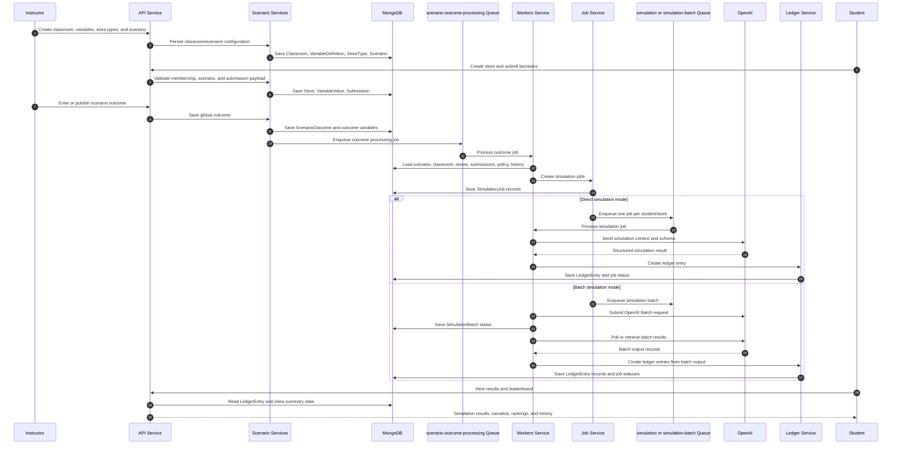

### Simulation Flow Description

1. The instructor creates or configures classroom data, including store types, variable definitions, and scenarios.
2. Students enroll in the classroom, create stores, and submit weekly scenario decisions.
3. The instructor enters the scenario outcome. This outcome applies globally, while each student impact depends on store setup, submission choices, and ledger history.
4. The scenario outcome controller persists the outcome and enqueues a `scenario-outcome-processing` job.
5. The workers service loads the scenario, classroom, enrolled stores, submissions, missing-submission policy, and relevant history.
6. Missing submissions are handled according to classroom policy. The worker can create default submissions, forward previous decisions, use AI-generated defaults, skip entries, or require instructor review depending on configured behavior.
7. `JobService` creates `SimulationJob` records for each student/store that should receive a result.
8. In direct mode, jobs are processed through the `simulation` queue. Each job sends a structured prompt to OpenAI and writes one `LedgerEntry`.
9. In batch mode, the system creates a `SimulationBatch`, submits work to the OpenAI Batch API, tracks provider status, ingests output, and writes ledger entries.
10. Students and instructors retrieve ledger entries, summaries, history, and leaderboard data through the API.

## Webhook Data Flow

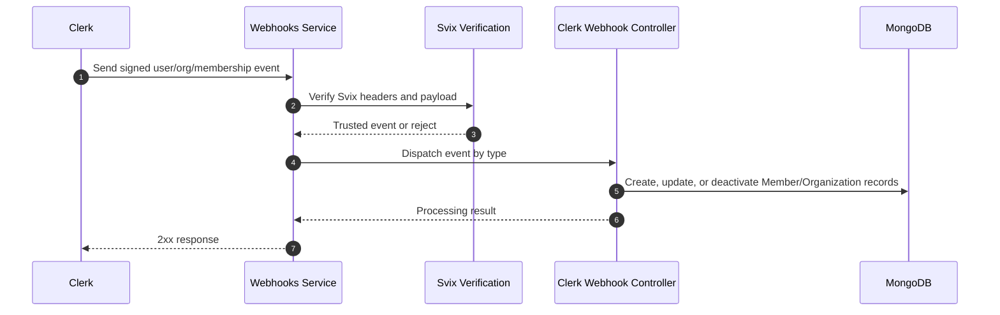

### Webhook Flow Description

1. Clerk sends signed webhook events to the webhooks service under `/v1/webhooks/clerk`.
2. The webhook middleware verifies the event signature using Svix.
3. Trusted events are routed to the Clerk webhook controller.
4. User, organization, and membership events synchronize local `Member` and `Organization` records in MongoDB.
5. The webhooks service returns a success response to Clerk after processing.

## Queue and Worker Data Flow

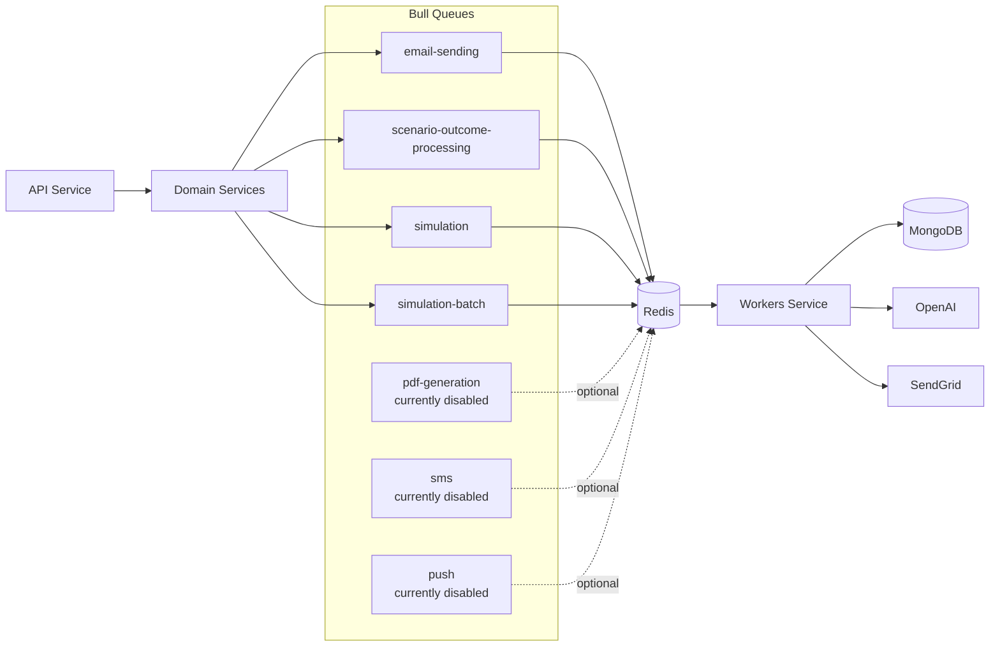

### Queue Flow Description

- `email-sending` processes notification email delivery through SendGrid.
- `scenario-outcome-processing` starts scenario closeout work after an instructor saves an outcome.
- `simulation` processes individual simulation jobs in direct mode.
- `simulation-batch` submits, tracks, and ingests OpenAI Batch API work in batch mode.
- `pdf-generation`, `sms`, and `push` workers exist in the codebase but are currently disabled or not part of the active production flow based on worker registration.

The workers service also supports scheduled jobs through Mongo-backed cron definitions and worker registry helpers.

## Notification and Email Data Flow

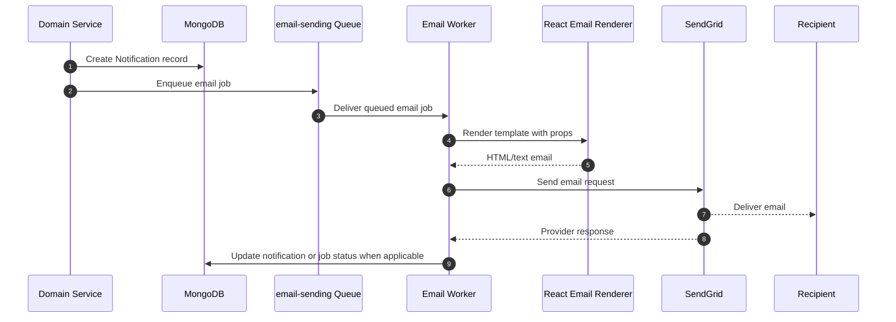

## Object Storage Data Flow

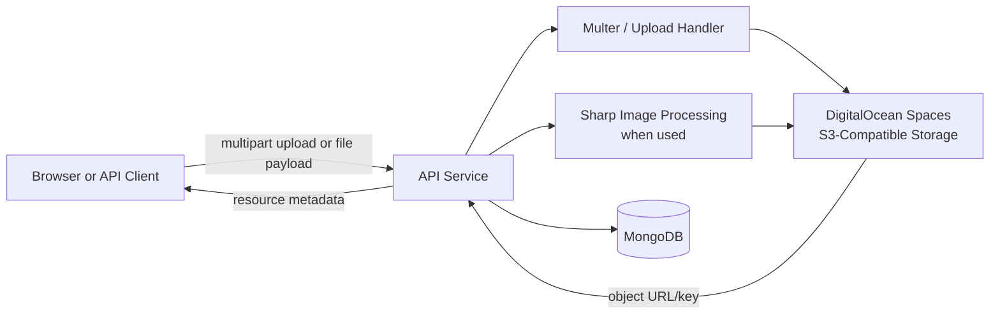

## Data Stores and Persistence

### MongoDB

MongoDB is the primary system of record. Mongoose models are registered through `models/index.js`, which loads model files from `services/**/*.model.js`.

Core persisted entities include:

- Organizations and members.
- Classrooms and enrollments.
- Store types, stores, variable definitions, and variable values.
- Scenarios, scenario outcomes, and submissions.
- Simulation jobs, simulation batches, and ledger entries.
- Notifications.
- Cron job definitions.

### Redis

Redis is used as the Bull queue backing store. It stores queue jobs, processing state, retries, delays, and job metadata for asynchronous workloads.

### Object Storage

DigitalOcean Spaces or another S3-compatible service stores uploaded files and generated or processed objects when those features are used.

## External Dependencies

| Provider | Purpose | Data Exchanged |
| --- | --- | --- |
| Clerk | Authentication, organizations, membership state, webhooks | User identity, organization IDs, roles, membership events |
| OpenAI | Simulation processing and auxiliary AI endpoints | Simulation context, prompts, structured output requests, AI responses |
| SendGrid | Transactional email | Recipient address, rendered template content, delivery metadata |
| DigitalOcean App Platform | Docker hosting for API, webhooks, and workers | Runtime configuration, application traffic, logs |
| DigitalOcean Spaces or S3-compatible storage | File and object storage | Uploaded files, generated objects, object keys/URLs |
| MongoDB provider | Primary database | Application records and operational state |
| Redis provider | Queue storage | Bull job payloads and processing metadata |

## Security and Control Boundaries

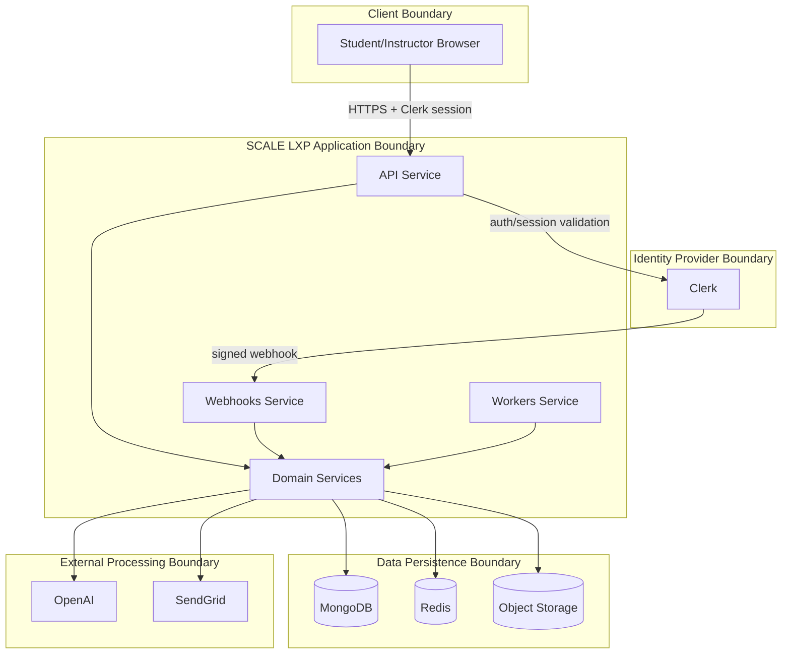

Important control points:

- Browser traffic should use HTTPS.
- Clerk provides authentication and organization context.
- Application middleware enforces role and organization authorization.
- MongoDB stores application data and should be protected with provider encryption, network restrictions, and least-privilege credentials.
- Redis stores queue payloads and should be treated as sensitive because jobs may contain identifiers or processing context.
- OpenAI receives simulation context required to produce ledger outputs.
- SendGrid receives recipient and message data required for transactional email.
- Object storage may contain uploaded or generated files and should use restricted credentials and appropriate bucket permissions.

## End-to-End Data Flow Summary

1. **Identity creation and synchronization:** Users authenticate through Clerk. Clerk webhooks synchronize user, organization, and membership changes into MongoDB through the webhooks service.
2. **Classroom setup:** Instructors use the API to create organizations, classrooms, enrollments, store types, variable definitions, and scenarios. These records are stored in MongoDB.
3. **Student setup:** Students join classes, create stores, and save variable values. Store and enrollment data is persisted in MongoDB and scoped to the classroom and organization.
4. **Weekly submissions:** Students submit scenario decisions through the API. Submissions and their variable values are stored in MongoDB.
5. **Outcome entry:** Instructors enter global scenario outcomes. The API stores the outcome and enqueues outcome processing in Redis.
6. **Job creation:** Workers load the scenario, outcome, submissions, stores, class policy, and ledger history, then create simulation jobs or batches in MongoDB and Redis.
7. **AI processing:** Workers send required simulation context to OpenAI. Results return as structured data and are validated or converted into ledger entries.
8. **Ledger publication:** Ledger entries are stored in MongoDB and become available to students and instructors through the API.
9. **Notifications:** Domain services create notifications and enqueue email jobs. Workers render templates and send messages through SendGrid.
10. **Ongoing operations:** Workers process scheduled jobs, retries, queue monitoring, and background maintenance. Administrators can inspect worker state through Bull Board when enabled.

## Deployment View

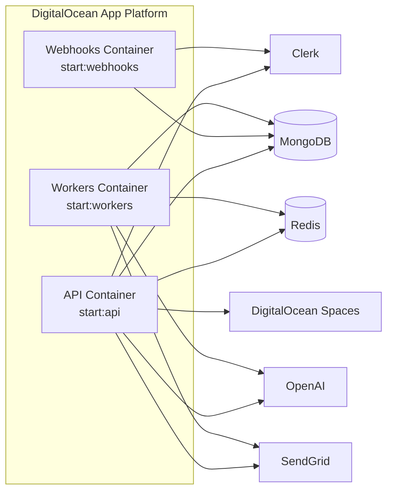

## Operational Notes

- All three primary apps share the same repository and model definitions.
- The API and workers both connect to MongoDB because worker processors need direct access to simulation, job, and ledger data.
- Queue payloads should remain minimal and should generally reference MongoDB record IDs instead of duplicating large or sensitive records.
- Direct simulation mode processes one job per student/store. Batch mode groups work through OpenAI Batch API and tracks the batch lifecycle in MongoDB.
- The webhooks app is intentionally separated from the API app so provider events can be scaled, secured, and monitored independently.
- Email rendering is separated from email sending so templates can be previewed and tested independently.
- Disabled workers and unused integrations should not be represented as active production dependencies unless enabled in deployment and worker registration.

## Source Reference Map

| Area | Key Paths |
| --- | --- |
| API app | `apps/api/index.js` |
| Webhooks app | `apps/webhooks/index.js`, `services/webhooks/` |
| Workers app | `apps/workers/index.js`, `services/workers/` |
| Main service router | `services/index.js` |
| Auth middleware | `middleware/auth.js` |
| Queue definitions and workers | `lib/queues/` |
| Simulation jobs | `services/job/`, `lib/queues/simulation-worker.js`, `lib/queues/simulation-batch-worker.js`, `lib/queues/outcome-processing-worker.js` |
| Ledger generation | `services/ledger/` |
| OpenAI integration | `lib/openai/`, `services/openai/` |
| Email integration | `lib/sendGrid/`, `lib/emails/`, `services/notifications/` |
| Object storage | `lib/spaces.js`, `lib/s3.js` |
| Model registration | `models/index.js` |
| Domain models | `services/**/*.model.js` |
